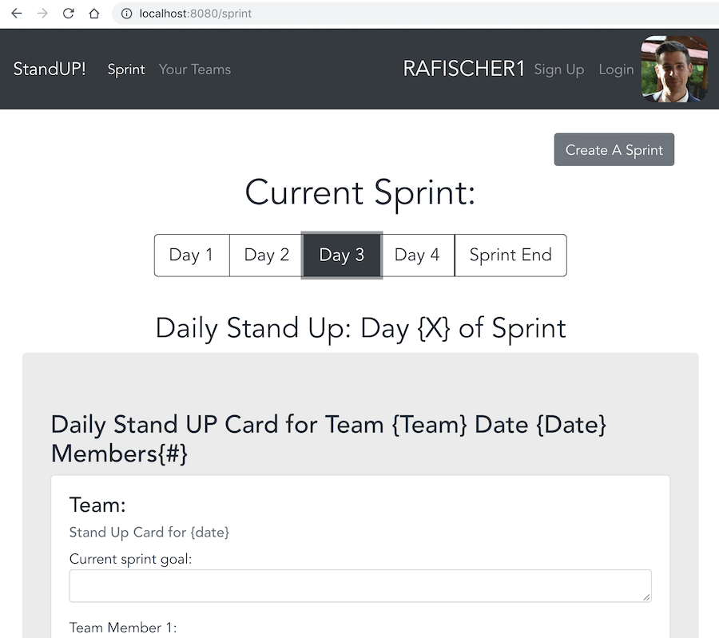

# ☃️ Stand Up Routes / Style Guide / Bootstrap Cheats ⛄️

## routes

  `/teams_users`

   * getAllTeams - every team, every user

   * addUserToATeam - teamId and userId weak table

   * Delete user from team

   `/users_teams`

   `/new_member/${name}` - join a team route call for profile

   `/sprints/${team_id}` post a sprint route

## To-do list

### Friday

[x] get id on teams list and link to /sprint page with information

[ ] when a team is selected and no sprints exist a check is made for an empty array and a modal appears to "Create a sprint"

[x] add a Create a sprint button on the sprint page

[ ] Post a sprint to `/sprints/${team_id}`

[ ] populate standup cards

[x] delete a team button

[x] capitalize team names back from db

[ ] tab through sprint days to load standUp components [link to Vue docs - tabs](https://vuejs.org/v2/guide/components-dynamic-async.html)

[ ] "logout" view toggling for signup/sign in and replace img to default 

[ ] join a team 

---
## Stretch goals

### bootstrap color themes:

> a select field on the Sprint View page that can toggle bootstrap themes for any view

[ ] default: dark, outline dark, accent: light, outline-light

[ ] "evening": info, text-dark, text-secondary,

[ ] "dark mode": text-white bg-dark secondary: danger

[ ] team names capitalize each word in string

[ ] make Footer a component rendered in App instead of just a class

[ ] "team name" input in profile still needs an error catch "on submit" for a team name that is < 4

### Info Popovers

on SignUp/Welcome page use [Popover Messages](https://bootstrap-vue.js.org/docs/components/popover) to display more info on Scrum/Agile philosophy

---

## Bootstrap Types

### `visible / invisible` can be used as display classes in b-vue

### `float-left` / `float-right` / `float-none` 

---

